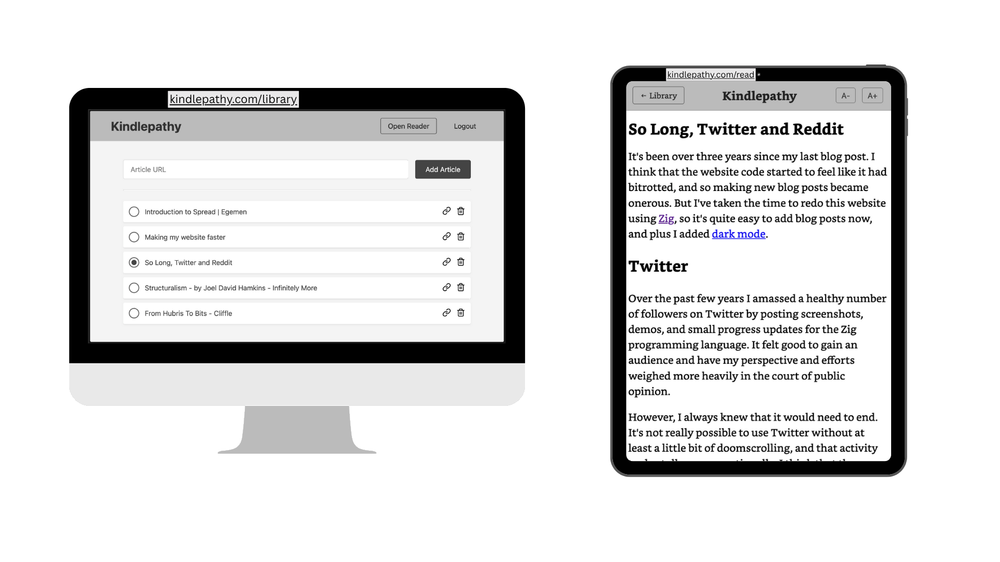

+++
title = "Introducing Kindlepathy"
date = 2025-06-13
description = "Introducing Kindlepathy: read web articles and blog posts on your Kindle's browser with a clean, lightweight HTML version. Send content from your PC or phone."
[taxonomies]
series = ["Kindlepathy"]
tags = ["kindle", "reading", "web-content", "e-reader"]
[extra]
series_index = 1
+++

I love my kindle and want to ***read web content*** (mainly blogposts alongside some grayscale manga) on it.

You could go directly to the ***website itself***. Not all websites are kindle-browser friendly, entering the page url by hand is not fun, sometimes you need to authenticate to access content.

You could make the ***posts into books*** via calibre or some online service. Reading experience is excellent, but you pollute your library with many small books. Sending those books is not instant as well.

---

**Kindlepathy** is in the middle. Once you open the [kindlepathy.com/read](https://kindlepathy.com/read) page on your kindle, that is all you need to do to read your articles. 

Using your PC or phone, you control which article you want to read next.

---

You can put the article url into the box over there, to let Kindlepathy download that article for you.

Some contents are require you to be authenticated, so there is a PC browser extension, that sends the current webpage as an article to Kindlepathy, for [Firefox](https://addons.mozilla.org/en-US/firefox/addon/kindlepathy-extractor) and [Chrome](https://chromewebstore.google.com/detail/eclacjdfoacbmgoiongjpmlaangpmbac)

---

The code is open-sourced at [GitHub](https://github.com/egemengol/kindlepathy), and the service is free to use at [kindlepathy.com](https://kindlepathy.com/). Check it out!
